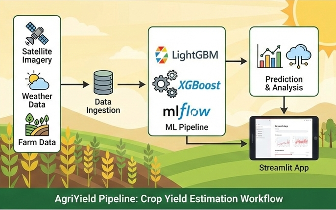

# 🌍 AirQo PM2.5 Prediction: Production ML Pipeline

A professional, modular, and production-ready machine learning pipeline designed to forecast **Particulate Matter (PM2.5)** concentrations across African cities using satellite-derived observations (AOD).


---



---

## 🎯 Project Overview

Air pollution is a critical environmental health risk in sub-Saharan Africa. This project implements a robust MLOps workflow to close the climate data gap by leveraging satellite data and high-performance regression models.

### ✨ Key Features

* **🏗️ Modular Architecture**: Clean separation between data ingestion, feature engineering, training, and inference.
* **🧪 Experiment Tracking**: Full integration with **MLflow** to log parameters, metrics, and models.
* **📉 Custom Transformers**: Advanced feature engineering including `TimeFeatureExtractor` and `OutlierHandler` with full Scikit-Learn pipeline compatibility.
* **🚀 One-Click Inference**: A sleek **Streamlit GUI** for end-users to upload data and download predictions.
* **🛡️ Robust Validation**: Custom City-based Cross-Validation to ensure spatial generalization.

---


### 🧰 Tech Stack & Tools 🛠️ 

| Category | Tools & Technologies |
| :--- | :--- |
| **Core** |  |
| **Data Processing** |   |
| **Machine Learning** |  |
| **Experiment Tracking** |  |
| **Visualization** |   |
| **Web App** |  |
| **CLI & Utilities** |  |


---

## 📂 Project Structure

```bash
airqo_pipeline/
├── data/                   # Raw and output datasets
│   ├── raw/          
│   └── output/
├── models/
│   ├── artifacts/          # Serialized .pkl pipelines
│   └── mlruns/             # MLflow local tracking database
├── notebooks/              # Research and EDA notebooks
├── reports/
│   └── figures/            # Automatically generated performance plots
├── src/                    # Core source code
│   ├── config.py           # Centralized configuration & Hyperparameters
│   ├── data/               # Ingestion and cleaning logic
│   ├── features/           # Custom Scikit-learn transformers
│   ├── models/             # Training and evaluation workflows
│   └── inference/          # Prediction scripts
├── app.py                  # Streamlit Dashboard
└── main.py                 # CLI Entry point

```

---

## ⚙️ Installation & Setup

This project uses **`uv`** for lightning-fast dependency management.

1. **Clone the Repository:**
```bash
git clone https://github.com/your-username/airqo-pm25-pipeline.git
cd airqo-pm25-pipeline

```


2. **Install Dependencies:**
```bash
uv sync

```


3. **Activate Environment:**
* Linux/Mac
```bash
source .venv/bin/activate
```
* Windows
```
.venv\Scripts\activate

```


---

## 🚀 Usage

### 1️⃣ Training the Model

Train the pipeline, run cross-validation, and log results to MLflow:

```bash
python main.py --mode train

```

* **Artifacts:** Saved to `models/artifacts/final_pipeline.pkl`.
* **Visuals:** Check `reports/figures/` for feature importance and regression fit plots.

### 2️⃣ Command Line Inference

Generate predictions for a new dataset via CLI:

```bash
python main.py --mode predict --input data/raw/Test.csv

```

### 3️⃣ Interactive Web App

Launch the Streamlit GUI for a user-friendly experience:

```bash
uv run python -m streamlit run app.py

```

---

## 📊 Model Performance

The pipeline supports multiple gradient boosting frameworks. By default, it uses **LightGBM** due to its speed and accuracy with satellite data. Performance metrics (RMSE, MAE, R²) are automatically logged and visualized after every training run.

---

## 🤝 Contributing

Contributions are welcome! Please feel free to submit a Pull Request.

---

## 📝 License

Distributed under the MIT License. See `LICENSE` for more information.

**Built with ❤️ for a cleaner Africa.** 🌍💨